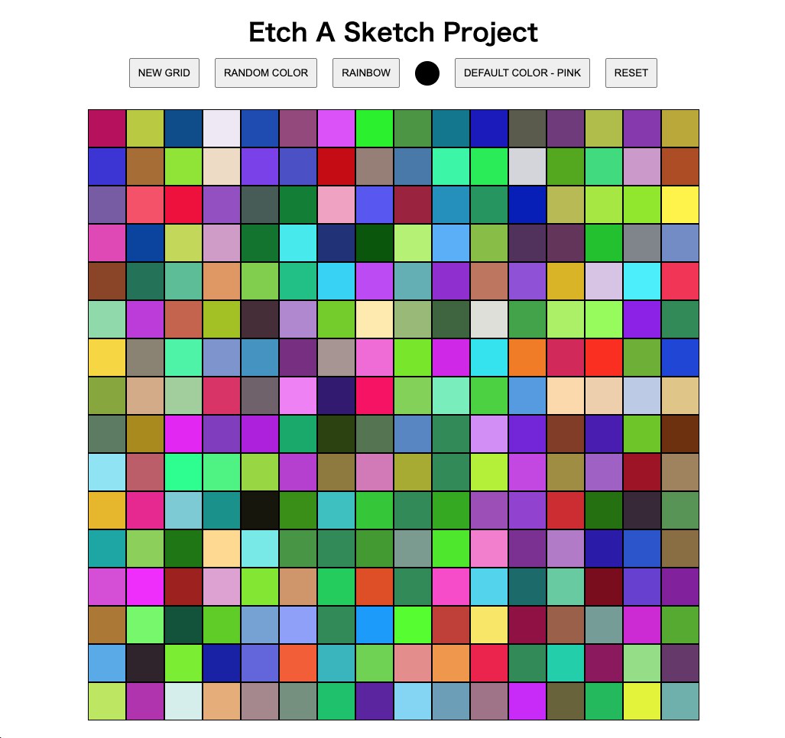

# Project: Etch-A-Sketch OverView

This is the Javascript foundations course in the Odin Project(URL:https://www.theodinproject.com/lessons/foundations-etch-a-sketch).

(The Odin Project is the free course for learning to become a fullstack web developer)

In this lesson, I have to create a browser version of something between a sketchpad and an Etch-A-Sketch. (Of course, I have to use HTML / CSS / JavaScript)

# Screen Shot

# What did I learn through this course

I had to use many skills in this Etch-A-Sketch project.

I used a little bit HTML fundamentals, used CSS rules for example "display Grid", but what I want you to pay attention here is my JavaScript DOM manipulation skills.

If you want to complete the project, you have to create Grid, remove Grid, use mouse hover event, mouse click event, create random color function, and do many extra works in the JavaScript world.

This is a relatively simple project.
But even so, I had to use many JavaScript skills.

Please check my written code.

And, I think my code proves my programming skill more than anything.

## Summary

All right!!
I finished another project by myself again!! (Of course, I used google several times. But it is ok. Because, search engine is best friend of programmers)

Definitely, I am growing everyday because of my hard work!!
I have a confident. And I have a uneasy also.
But it is normal. 

Just do my best and keep going!!

Thank you for reading.
And, happy coding!!!